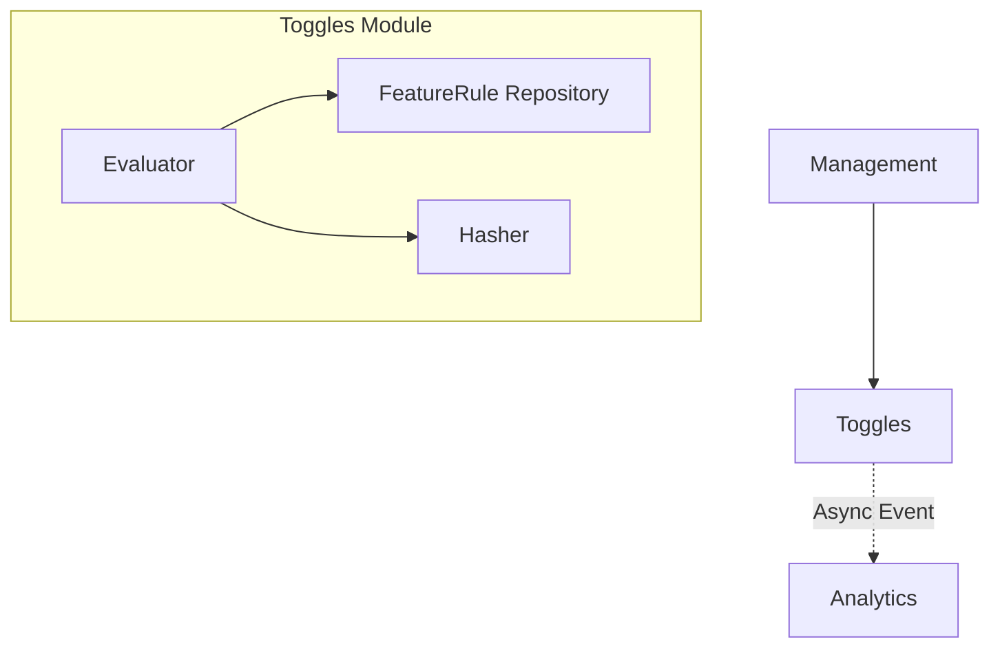

# Design: Foundation (Phase 1)

**Spec**: `.specs/features/foundation/spec.md`

---

## Architecture Overview

We will split the application into three primary **Spring Modulith** modules. The `toggles` module will be the core of Phase 1.

## Module Structure (com.product.ground_control)

### 1. `toggles`
- `domain`: `FeatureRule` (Aggregate Root), `RuleType` (Enum), `RuleCondition` (Value Object), `RuleResult` (Value Object).
- `application`: `ToggleEvaluator` (Domain Service).
- `infrastructure`: `TogglesRuleEntity` (JPA), `RuleConverter` (JSONB).

### 2. `analytics` (Skeleton)
- `api`: Event listener for internal Spring Events.

### 3. `management` (Skeleton)
- `api`: REST endpoint for rule creation (basic implementation).

---

## Data Model (PostgreSQL)

### `toggles_feature_rule`
- `id`: UUID (PK)
- `key`: String (Unique index)
- `type`: String (BOOLEAN, STRING, JSON)
- `rules`: JSONB (Prioritized list of conditions and results)
- `default_value`: String
- `created_at`, `updated_at`: Timestamps

---

## Evaluation Path (Logic)

1. **Input**: `(featureKey, contextData)`.
2. **Action**: Fetch `FeatureRule` by key from repository.
3. **Logic (The Cascade)**:
   - For each `Rule` in `rules` (ordered by priority):
     - If `RuleCondition` matches `contextData` OR `RuleRollout` (deterministic hash) is within range:
       - **Return result**.
   - If no match, **Return `default_value`**.
