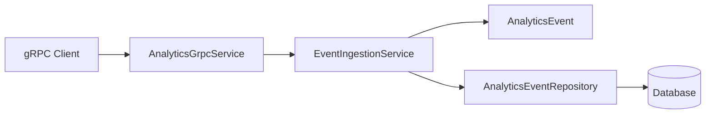

# Design - gRPC Analytics Ingestion

Architecture and components for the high-performance analytics ingestion via gRPC.

## Architecture Overview

The gRPC service acts as an **Adapter** in the Hexagonal Architecture (Infrastructure layer), delegating to the **Application Service** (`EventIngestionService`), which in turn interacts with the **Domain Entity** (`AnalyticsEvent`) and **Port** (`AnalyticsEventRepository`).



## Protobuf Definition

The service will be defined in `src/main/proto/analytics.proto`.

```protobuf
syntax = "proto3";
package com.product.ground_control.analytics.api.grpc;

option java_multiple_files = true;
option java_package = "com.product.ground_control.analytics.api.grpc";

message IngestRequest {
  string featureKey = 1;
  string variation = 2;
  string subjectId = 3;
  map<string, string> metadata = 4;
}

message IngestResponse {
  bool success = 1;
  string message = 2;
}

service AnalyticsService {
  rpc Ingest (IngestRequest) returns (IngestResponse);
}
```

## Solving the Dual-Write Problem

To avoid dual-write inconsistencies (e.g., storing the event but failing to notify other systems, or vice versa), we rely on the following:

1.  **Atomicity**: All ingestion logic inside `EventIngestionService.ingest` is wrapped in a single `@Transactional`.
2.  **Transactional Outbox (Spring Modulith)**: Since the project uses Spring Modulith, any domain events published during ingestion (if any are added in the future) are automatically registered in the `EVENT_PUBLICATION` table within the same database transaction.
3.  **Idempotency**: While not strictly required for the initial version, the `subjectId` and `timestamp` (if added to the proto) can be used to derive a unique business key if exactly-once semantics are required by the user.

## Component Responsibilities

- **AnalyticsGrpcService**: Maps gRPC `IngestRequest` to `EventIngestionService.ingest` call. Handles gRPC-specific error mapping.
- **EventIngestionService**: Orchestrates the domain logic, creating the rich entity and persisting it.
- **AnalyticsEvent**: Encapsulates the rich domain logic (Value Objects, creation factory).
