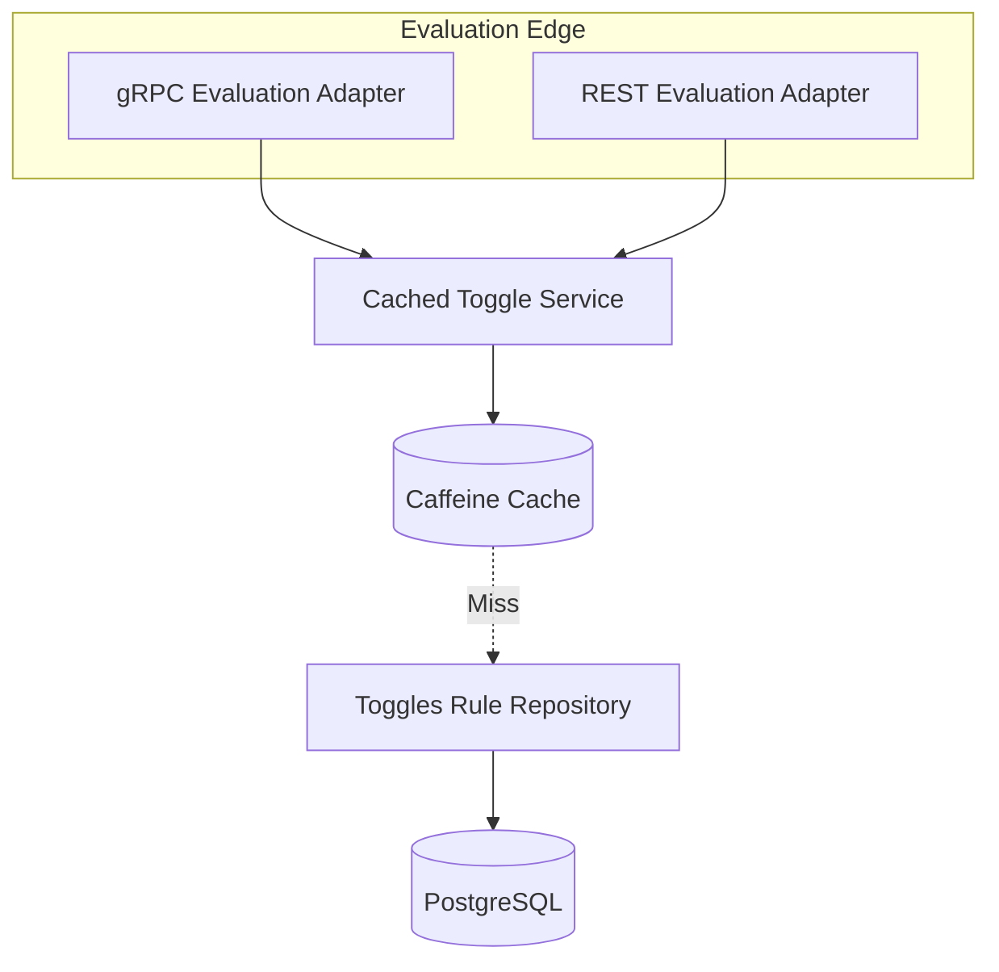

# Design: High-Performance Edge (Milestone 2)

**Spec**: `.specs/features/high-performance-edge/spec.md`

---

## Architecture Overview

We will introduce a **Cached Layer** in front of the `toggles` domain and expose it through two distinct adapters.



## Component Definitions

### 1. `CachedToggleService` (Application Layer)
- **Purpose**: Acts as the primary orchestrator for the evaluation path.
- **Cache Strategy**: "Cache-aside" - tries Caffeine first, falls back to Repository, and updates cache.
- **Invalidation**: (Phase 1) - Simple time-based expiration (e.g., 5 min) or event-based if possible.

### 2. `EvaluationService` (gRPC Adapter)
- **Protobuf**: `evaluation.proto` defining `EvalRequest` and `EvalResponse`.
- **Performance**: Leveraging Protobuf's binary serialization for speed and small payload size.

### 3. `EvaluationController` (REST Adapter)
- **Contract**: JSON-based POST to `/api/v1/rules/eval`.
- **Performance**: High, but generally slower than gRPC due to text-based serialization.

---

## Technical Details

### gRPC Contract (`proto/evaluation.proto`)
```protobuf
syntax = "proto3";

package com.product.ground_control.toggles.api;

message EvalRequest {
  string featureKey = 1;
  map<string, string> context = 2;
}

message EvalResponse {
  string result = 1;
  string type = 2; // BOOLEAN, STRING, JSON
}

service EvaluationService {
  rpc Evaluate (EvalRequest) returns (EvalResponse);
}
```

### Caffeine Configuration
- **Name**: `featureRulesCache`
- **Settings**:
  - `maximumSize`: 10,000 rules.
  - `expireAfterWrite`: 5 minutes (initially).
  - `recordStats`: Enabled for monitoring.

---

## Evaluation Flow (The "Nerve Center")
1. Request arrives via **gRPC or REST**.
2. Service calls `Caffeine.get(featureKey)`.
3. If **Hit**: Evaluate using `ToggleEvaluator` with cached `FeatureRule`.
4. If **Miss**: Fetch `FeatureRule` from DB, cache it, and evaluate.
5. Result is returned instantly to the caller.
