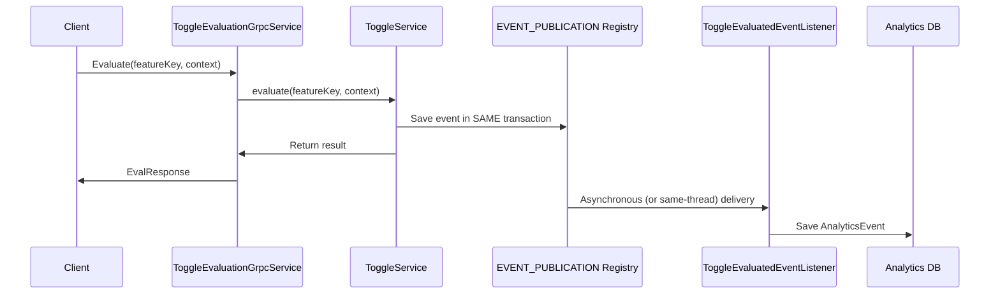

# Design - Reliable gRPC Analytics Ingestion

Ensure that gRPC evaluation calls trigger analytics ingestion reliably using Spring Modulith's Transactional Outbox pattern.

## Architecture & Data Flow

## Dual-Write Prevention

1.  **Transactional Integrity**: By marking `ToggleService.evaluate` as `@Transactional`, we ensure that the evaluation and the storage of the event in the `EVENT_PUBLICATION` registry are atomic.
2.  **No Data Loss**: If the database transaction commits, the event is guaranteed to be in the outbox. Even if the listener fails (e.g., due to a temporary DB error in analytics), Modulith will retry the delivery.
3.  **Module Decoupling**: The `toggles` module doesn't know about `analytics`. It just publishes an event and depends on the infrastructure to handle the delivery reliably.

## Refactoring Steps

### [Component] Toggles Module
Ensuring evaluations are transactional.

#### [MODIFY] [ToggleService](file:///Users/rafael/Documents/ground-control/src/main/java/com/product/ground_control/toggles/application/services/ToggleService.java)
- Add `@Transactional` to `evaluate` method. 
- Ensure `eventPublisher.publishEvent` is called inside the transaction.

---

### [Component] Analytics Module Cleanup
Removing the redundant gRPC ingestion layer.

#### [DELETE] [analytics.proto](file:///Users/rafael/Documents/ground-control/src/main/proto/analytics.proto)
#### [DELETE] [AnalyticsGrpcService](file:///Users/rafael/Documents/ground-control/src/main/java/com/product/ground_control/analytics/infrastructure/api/grpc/AnalyticsGrpcService.java)

---

### [Component] Integration Verification
Ensuring the flow works end-to-end.

#### [MODIFY] [EvaluationIntegrationTest](file:///Users/rafael/Documents/ground-control/src/test/java/com/product/ground_control/toggles/api/EvaluationIntegrationTest.java)
- Verify that a gRPC evaluation triggers an entry in the `analytics_events` table (or mock/spy the listener).
- Verify the outbox table existence/usage.
