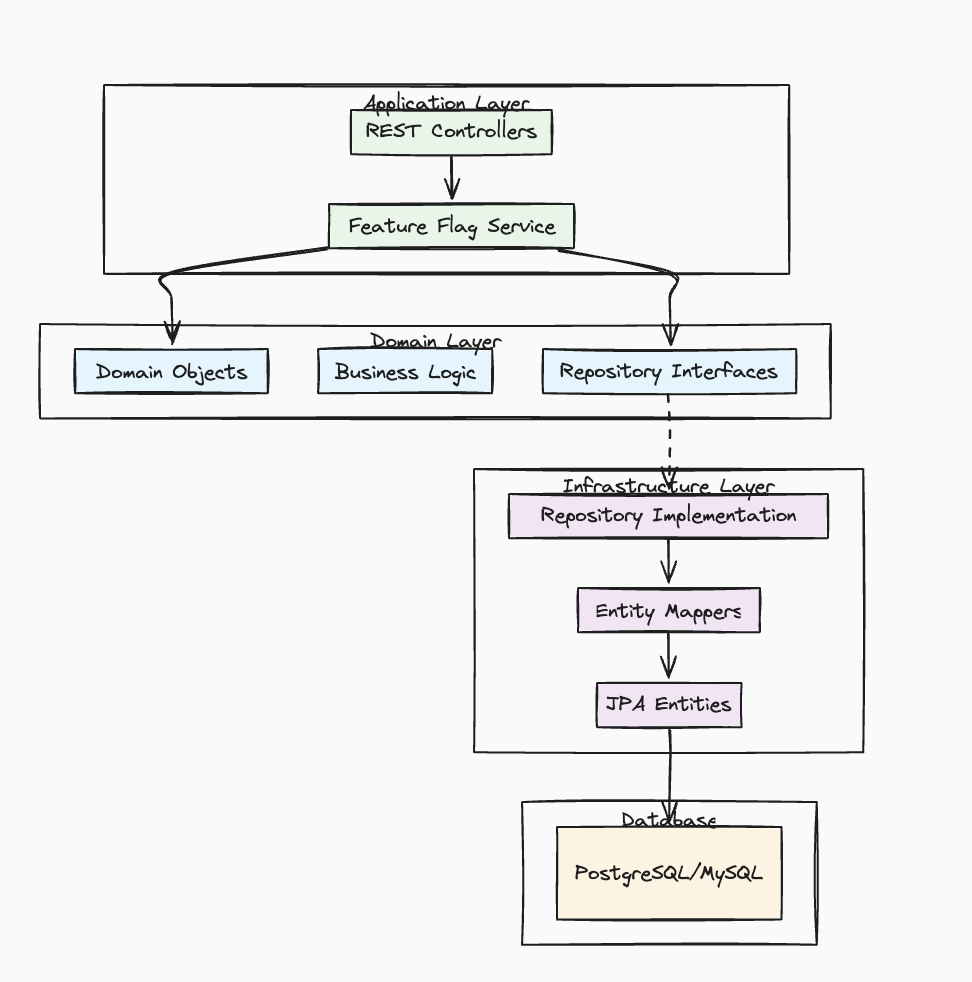

# Ground Control 🚀

A Spring Boot application for managing feature flags with rollout rules and dynamic configuration.

## 📋 Overview

Ground Control is a feature flag management system built with Kotlin and Spring Boot. It enables dynamic feature rollouts, configuration management, and supports multiple value types for enterprise applications.

## 🔧 Tech Stack

- **Language**: Kotlin
- **Framework**: Spring Boot
- **Build Tool**: Gradle 8.x
- **Container**: Docker / docker-compose
- **Monitoring**: Prometheus & Grafana
- **Architecture**: Domain-Driven Design (DDD)
- **Testing**: JUnit 5

## 🏗️ Architecture

The application follows Domain-Driven Design principles with clear separation of concerns:



### Domain Layer Structure
- **Value Objects**: `FeatureFlag`, `FeatureFlagCode`, `FeatureFlagId`, `FeatureFlagName`, `RolloutRule`
- **Entities**: `FeatureFlagEntity` with JPA annotations
- **Mappers**: Bidirectional conversion between domain objects and entities
- **Enums**: `FlagType` for different value types (INT, STRING, PERCENTAGE, BOOLEAN)

## 🎯 Features

### Feature Flag Management
- ✅ Create, update, and delete feature flags
- 🎛️ Enable/disable flags dynamically
- ⏰ Schedule flag activation with timestamps
- 📝 Rich metadata support (name, description, audit trails)

### Supported Value Types
- 🔢 **INT**: Integer values for numeric configurations
- 📝 **STRING**: Text values for string configurations
- 📊 **PERCENTAGE**: Percentage-based gradual rollouts (0-100%)
- ✅ **BOOLEAN**: Simple on/off toggle flags

### Rollout Rules & Evaluation Engine
- 🎯 Advanced targeting with custom rollout rules
- 🔄 Runtime rule modification support
- 🔗 Rules linked to parent feature flags
- 📊 Flexible rule evaluation system
- 🚀 **Real-time flag evaluation with context-based targeting**
- 🧠 **Multi-condition rule processing with AND logic**
- 🎲 **Deterministic percentage rollouts with consistent hashing**
- 🌍 **Multi-tenant support with subject-based evaluation**
- ⚡ **Bulk evaluation for performance optimization**

## 🚀 Getting Started

### Prerequisites
- Java 11+
- Docker (optional)
- Gradle 8+ (included via wrapper)

### Quick Start

```bash
# Clone the repository
git clone <repository-url>
cd groundcontrol

# Run with Gradle
./gradlew bootRun

# Or run with Docker
docker-compose up
```

### Building 

```bash
# Build the application
./gradlew build

# Run tests
./gradlew test

# Create JAR
./gradlew bootJar
```

##  📊Monitoring & Observability
- Metrics: Prometheus endpoint at /actuator/prometheus
- Logging: Structured JSON logs in logs/app-json.log
- Health Checks: Spring Boot Actuator endpoints
- Test Reports: Generated in build/reports/tests/test/index.html

## 🗂️ Project Structure
```
groundcontrol/
├── src/
│   ├── main/
│   │   ├── kotlin/com/platform/groundcontrol/
│   │   │   └── domain/
│   │   │       ├── entities/     # JPA entities
│   │   │       ├── enums/        # FlagType definitions
│   │   │       ├── mappers/      # Domain ↔ Entity conversion
│   │   │       └── valueobjects/ # Domain models
│   │   └── resources/
│   │       ├── application.properties
│   │       ├── logback-spring.xml
│   │       ├── static/           # Static web assets
│   │       └── templates/        # Template files
│   └── test/kotlin/              # Test sources
├── assets/
│   └── layers.png               # Architecture diagram
├── logs/
│   └── app-json.log             # Application logs
├── build/
│   ├── libs/                   # Generated JARs
│   └── reports/                # Test and coverage reports
├── gradle/wrapper/             # Gradle wrapper files
├── docker-compose.yaml         # Container orchestration
├── prometheus.yml              # Metrics collection
├── Dockerfile                  # Container definition
└── build.gradle                # Build configuration
```

## 🔧 Configuration

### Key Configuration Files
- **application.properties** - Spring Boot application settings
- **docker-compose.yaml** - Multi-container Docker setup
- **prometheus.yml** - Metrics scraping configuration
- **logback-spring.xml** - Structured logging setup
- **Dockerfile** - Container build instructions

## 🧪 Testing

```bash
# Run all tests
./gradlew test

# View test reports
open build/reports/tests/test/index.html

# Run load test with k6
k6 run load-test-k6.js

# Check test results
ls build/test-results/test/
```
The project includes comprehensive test coverage with JUnit 5, generates detailed HTML reports, and includes k6 load testing for the evaluation engine.

## 🎮 API Usage & Examples

### Complete Workflow Example

This section demonstrates the complete feature flag lifecycle from creation to evaluation.

#### 1. Create a Feature Flag

```bash
POST /flags
Content-Type: application/json

{
  "code": "premium-features",
  "name": "Premium Features Access",
  "description": "Controls access to premium features based on user plan",
  "enabled": true,
  "valueType": "BOOLEAN",
  "value": true
}
```

#### 2. Add Rollout Rules with Conditions

```bash
POST /flags/premium-features/rollout-rules
Content-Type: application/json

{
  "percentage": 50.0,
  "priority": 1,
  "active": true,
  "variantName": "premium_variant",
  "startAt": "2024-01-01T00:00:00Z",
  "endAt": "2024-12-31T23:59:59Z",
  "conditions": [
    {
      "attribute": "plan",
      "operator": "EQUALS",
      "value": "premium",
      "dataType": "STRING"
    },
    {
      "attribute": "creditScore",
      "operator": "GREATER_THAN",
      "value": 700,
      "dataType": "NUMERIC"
    }
  ]
}
```

#### 3. Evaluate Single Flag

```bash
POST /evaluations/premium-features
Content-Type: application/json

{
  "subjectId": "user_12345",
  "attributes": {
    "plan": "premium",
    "creditScore": 750,
    "country": "US",
    "signupDate": "2024-01-15T10:30:00Z"
  }
}
```

**Response:**
```json
{
  "enabled": true,
  "value": true,
  "valueType": "BOOLEAN",
  "variant": "premium_variant",
  "reason": "RULE_MATCH"
}
```

#### 4. Bulk Evaluation

```bash
POST /evaluations/bulk
Content-Type: application/json

{
  "flagCodes": ["premium-features", "dark-mode", "new-dashboard"],
  "context": {
    "subjectId": "user_12345",
    "attributes": {
      "plan": "premium",
      "creditScore": 750,
      "country": "US",
      "preferences": {
        "theme": "dark",
        "beta": true
      }
    }
  }
}
```

**Response:**
```json
{
  "premium-features": {
    "enabled": true,
    "value": true,
    "valueType": "BOOLEAN",
    "variant": "premium_variant",
    "reason": "RULE_MATCH"
  },
  "dark-mode": {
    "enabled": true,
    "value": "dark",
    "valueType": "STRING",
    "reason": "DEFAULT"
  },
  "new-dashboard": {
    "enabled": false,
    "value": null,
    "reason": "FLAG_DISABLED"
  }
}
```

### Advanced Condition Examples

#### Multi-Tenant B2B Application
```json
{
  "subjectId": "tenant_acme_corp",
  "attributes": {
    "tier": "enterprise",
    "employees": 5000,
    "industry": "finance",
    "contractValue": 150000,
    "supportLevel": "premium"
  }
}
```

#### Mobile Application Context
```json
{
  "subjectId": "device_abc123",
  "attributes": {
    "os": "ios",
    "version": "15.2",
    "deviceType": "iphone",
    "premium": true,
    "lastSeen": "2024-01-15T14:30:00Z"
  }
}
```

#### Geographic Rollout
```json
{
  "subjectId": "user_67890",
  "attributes": {
    "country": "CA",
    "timezone": "America/Toronto",
    "language": "en-CA",
    "beta_tester": false
  }
}
```

### Supported Operators & Data Types

| Data Type | Supported Operators |
|-----------|-------------------|
| **STRING** | `EQUALS`, `NOT_EQUALS`, `CONTAINS`, `STARTS_WITH`, `ENDS_WITH` |
| **NUMERIC** | `EQUALS`, `NOT_EQUALS`, `GREATER_THAN`, `GREATER_THAN_OR_EQUAL`, `LESS_THAN`, `LESS_THAN_OR_EQUAL` |
| **BOOLEAN** | `EQUALS`, `NOT_EQUALS` |
| **ARRAY** | `CONTAINS`, `NOT_CONTAINS` |
| **DATE** | `EQUALS`, `NOT_EQUALS`, `BEFORE`, `AFTER` |

### Evaluation Reasons

- `RULE_MATCH`: Flag matched a specific rollout rule
- `DEFAULT`: No rules matched, returned flag's default value
- `FLAG_DISABLED`: Flag is disabled globally
- `FLAG_EXPIRED`: Flag has expired based on timestamps


## 📈 Development

### Development Features
- 🔄 Incremental Kotlin compilation with caching
- 📦 Gradle wrapper for consistent builds
- 🐳 Docker support for containerized development
- 📊 Built-in metrics and health monitoring
- 🧪 Automated test execution and reporting

### Code Quality
- Domain-driven design patterns
- Clean architecture principles
- Type-safe Kotlin implementations
- Comprehensive error handling and logging
