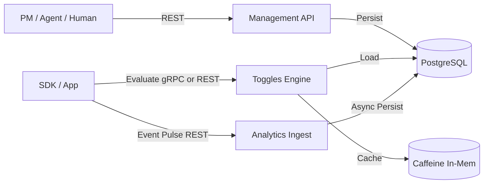

# TDD - Ground Control Core (Feature Management & Analytics)

| Field           | Value                                      |
| --------------- | ------------------------------------------ |
| Tech Lead       | @rafael                                    |
| Product Manager | Ground Control PM                          |
| Team            | @rafael                                    |
| Epic/Ticket     | GC-CORE-001                                |
| Status          | Draft                                      |
| Created         | 2026-03-25                                 |
| Last Updated    | 2026-03-25                                 |

---

## 1. Context
**Ground Control** is a high-performance feature management and experimentation platform. It enables real-time configuration (Booleans, Strings, JSON) based on complex rules (Policy Assessment) and gathers analytics to empower both Product Managers and Autonomous Agents.

**Background**:
Existing tools (LaunchDarkly, Statsig) are often "passive" toggles and can be clunky. Ground Control aims to be "Agent-Native," high-craft (Notion/Resend style), and infrastructure-aware, leveraging **Java 21 + GraalVM** for sub-5ms policy assessment.

**Domain**:
Feature Management, Experimentation, and Real-time Analytics.

---

## 2. Problem Statement & Motivation

### Problems We're Solving
- **Deployment Lag**: PMs and Devs lose momentum waiting for CI/CD cycles just to change a configuration string or rollout percentage.
- **Infrastructure Desync**: Feature rollouts are often disconnected from infrastructure readiness (pods, regions, latency).
- **Manual "Flag Ops"**: Managing stale flags and monitoring rollouts is manual and error-prone.

### Why Now?
- High-velocity teams need **instant feedback** and **autonomous control** (Agents) to scale experiments safely.
- **Data is Gold**: Without integrated analytics, the impact of a feature toggle remains invisible or delayed.

---

## 3. Scope

### ✅ In Scope (V1 - Atomic MVP)
- **Dynamic Rules Engine**: Support for Booleans, Strings, and JSON-based configuration.
- **Context-Aware Evaluation**: Rules based on User Profile (VIP, Tier), Region, and custom attributes.
- **High-Performance In-Memory Cache**: Sub-5ms evaluation latency.
- **Event Ingestion**: Basic endpoint for "Data Pulse" analytics events.
- **Management API (REST)**: Create, update, and list feature rules.
- **Dual-Protocol Evaluation Path**: High-speed **gRPC** for SDKs/Agents and **REST** for universal access.

### ❌ Out of Scope (V1)
- **Complex UI**: V1 focuses on the Core Engine and API (Agent-Native).
- **Advanced BI Suite**: Deep data visualization (deferred to V2).
- **Complex Security**: Auth/RBAC (deferred as per user request).
- **Multi-region Synchronization**: V1 targets single-region consistency.

---

## 4. Technical Solution

### Architecture Overview
Ground Control uses a **Modular Monolith (Spring Modulith)** architecture, optimized for **GraalVM Native Image** and **Java 21 Virtual Threads**. It employs a **Unified Domain Engine** exposed via a **Dual-Protocol Edge**: REST for universal access/management and gRPC for performance-critical evaluation.

**Key Modules**:
- `toggles`: Core domain for rule evaluation (Cascading Rules) and caching.
- `analytics`: Ingests and stores event data asynchronously.
- `management`: Public-facing REST API for rule configuration.

**High-Level Flow**:
1. **Management** stores rules in **PostgreSQL**.
2. **Toggles** module caches active rules in **Caffeine (In-Memory)**.
3. **SDK/Agent/Human** requests evaluation via **gRPC (Protobuf)** OR **REST (JSON)**.
4. **Toggles** evaluates context against a **Prioritized Cascade** of rules.
5. **Analytics** receives "Data Pulse" events and stores them for later assessment.

### Architecture Diagram

### Evaluation Logic (The Cascade)
To ensure "Atomic Enchantment" and deterministic results:
- **Priority Order**: Rules are evaluated from Priority 1 to N. The first matching rule "wins."
- **Deterministic Rollout**: Percentage-based rollouts use consistent hashing (`hash(userId + featureKey) % 100`) to ensure a stable user experience without database lookups.
- **Value Types**: Supports `BOOLEAN`, `STRING`, and `JSON` configuration values.

### Domain Model (Tactical DDD)
- **Aggregate Root**: `FeatureRule` (Toggles Module)
  - `RuleDefinition`: The logic (JSONB).
  - `RuleContext`: Requirements (Region, Tier, etc.).
  - `DefaultValue`: The fallback.
- **Aggregate Root**: `AnalyticsEvent` (Analytics Module)
  - `EventMetadata`: Context of the event.
  - `ImpactScore`: (Optional/Future) calculated impact.

### APIs & Endpoints

| Endpoint               | Protocol | Description                     | Request             | Response           |
| ---------------------- | -------- | ------------------------------- | ------------------- | ------------------ |
| `/api/v1/rules`        | REST     | Create/Update feature rule      | `RuleDto`           | `RuleDto`          |
| `/api/v1/rules/eval`   | REST     | Universal Rule Evaluation (JSON)| `EvalRequest`       | `EvalResponse`     |
| `EvaluationService`    | gRPC     | High-speed Rule Evaluation (Bin)| `EvalRequest`       | `EvalResponse`     |
| `/api/v1/events`       | REST     | Ingest a data pulse event       | `AnalyticsEventDto` | `202 Accepted`     |

---

## 5. Risks

| Risk | Impact | Probability | Mitigation |
|------|--------|-------------|------------|
| Rule Evaluation Latency | High | Medium | Use in-memory Caffeine cache; avoid DB lookups on critical path. |
| Database Bloat (Analytics) | Medium | High | Use PostgreSQL partitions for events; implement retention policies early. |
| GraalVM Compatibility | High | Low | Regular native-image builds in CI; avoid reflection and unconfigured dynamic proxies. |
| Cache Incoherence | Medium | Medium | Use DB triggers or Spring Events to invalidate/refresh cache on rule updates. |

---

## 6. Implementation Plan

| Phase                 | Task                      | Description                                    | Owner   | Estimate |
| --------------------- | ------------------------- | ---------------------------------------------- | ------- | -------- |
| **Phase 1: Foundation** | Project Setup             | Spring Modulith + GraalVM + PostgreSQL config | @rafael | 2d       |
|                       | Toggles Domain            | `FeatureRule` Aggregate & Rule Engine logic    | @rafael | 5d       |
| **Phase 2: Ingestion** | Analytics Module          | Async event ingestion & storage logic          | @rafael | 4d       |
| **Phase 3: APIs**     | Management & REST Eval    | REST controllers for CRUD and Evaluation       | @rafael | 4d       |
| **Phase 4: Optimization**| Caffeine & gRPC Integration| Implementation of the rule cache and gRPC edge | @rafael | 5d       |
| **Phase 5: Validation**| Native Build & Load Test  | Verify GraalVM build and sub-5ms p99 latency   | @rafael | 4d       |

---

## 7. Monitoring & Observability
- **Metrics**: 
  - `assessment.latency`: Target p99 < 5ms.
  - `event.ingest.rate`: Throughput of the pulse endpoint.
  - `cache.hit_rate`: Effectiveness of the rule cache.
- **Logs**: Structured JSON logging for rule evaluations (Redacted/No PII).

---

## 8. Rollback Plan
- **Default Fallback**: Every `FeatureRule` MUST have a hard-coded or configuration-based `DefaultValue`.
- **Engine Failure**: If evaluation fails, the system returns the `DefaultValue` instantly.
- **Feature Flag (Dogfooding)**: Ground Control will manage its own internal features; revert via its own Management API.

---

## 9. Architecture Compliance
- [ ] Module has dedicated tables (`toggles_rule`, `analytics_event`).
- [ ] No cross-module entity imports.
- [ ] Async communication for Analytics ingestion.
- [ ] Sub-5ms evaluation path verified.
- [ ] GraalVM Native Image builds successfully.

---

## 10. Roadmap & Milestones

This roadmap focuses on delivering "Atomic Enchantment" at each step, moving from the core logic to the high-performance edge.

### 🎯 Milestone 1: The Engine (The "Heart")
**Goal**: A working, testable Rule Engine that supports the "Cascade" and "Deterministic Rollout."
- [ ] **Setup**: Project structure with `toggles`, `analytics`, and `management` modules.
- [ ] **Core Logic**: Implementation of the `FeatureRule` aggregate and the `Evaluator` service.
- [ ] **Feature**: Boolean and String value support.
- [ ] **Feature**: Percentage-based rollout logic (Deterministic Hashing).
- [ ] **Checkpoint**: A unit test suite verifying a complex 3-rule cascade with stable 10% rollout results.

### 🎯 Milestone 2: High-Performance Edge (The "Speed")
**Goal**: Moving from DB lookups to sub-5ms in-memory evaluation and binary communication.
- [ ] **Caffeine**: Integration of the in-memory cache for active rules.
- [ ] **gRPC**: Protobuf definitions and the `EvaluationService` implementation.
- [ ] **REST Eval**: Implementation of the `/api/v1/rules/eval` endpoint for universal access.
- [ ] **Checkpoint**: A benchmark showing < 5ms latency for rule evaluation via both REST and gRPC.

### 🎯 Milestone 3: The Data Pulse (The "Gold")
**Goal**: Connecting the engine to real-world outcomes through event ingestion.
- [ ] **Persistence**: Analytics schema and event storage logic.
- [ ] **Async Flow**: Spring Events / Virtual Threads integration for non-blocking ingestion.
- [ ] **API**: Implementation of the `/api/v1/events` endpoint.
- [ ] **Checkpoint**: Evaluation results can be correlated with ingested events in the database without adding latency to the evaluation path.

### 🎯 Milestone 4: The Control Plane (The "UI-Ready")
**Goal**: A robust API for humans and agents to manage the system.
- [ ] **Management API**: Full CRUD for `FeatureRule` with validation.
- [ ] **Context Mapping**: Definition of standard "Context" attributes (Region, VIP, Tier).
- [ ] **Audit Log**: Basic persistence of who changed what and why.
- [ ] **Checkpoint**: An Agent can successfully create, update, and then evaluate a rule via the API.

### 🎯 Milestone 5: Production Ready (The "Native")
**Goal**: A GraalVM-optimized binary ready for high-scale deployment.
- [ ] **GraalVM**: Configuration and successful build of the Native Image.
- [ ] **Observability**: Integration of Micrometer/Prometheus metrics for latency and cache hits.
- [ ] **Load Test**: Stress testing the "Nerve Center" under 1000+ RPS.
- [ ] **Checkpoint**: Successful execution of the full suite within a GraalVM native container with p99 < 5ms.
